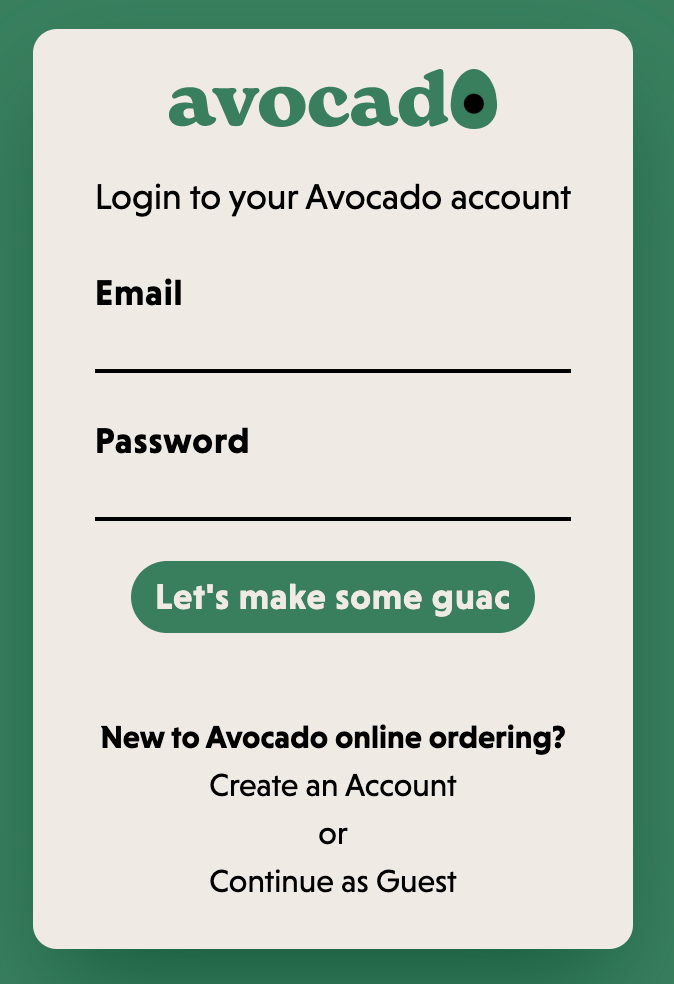
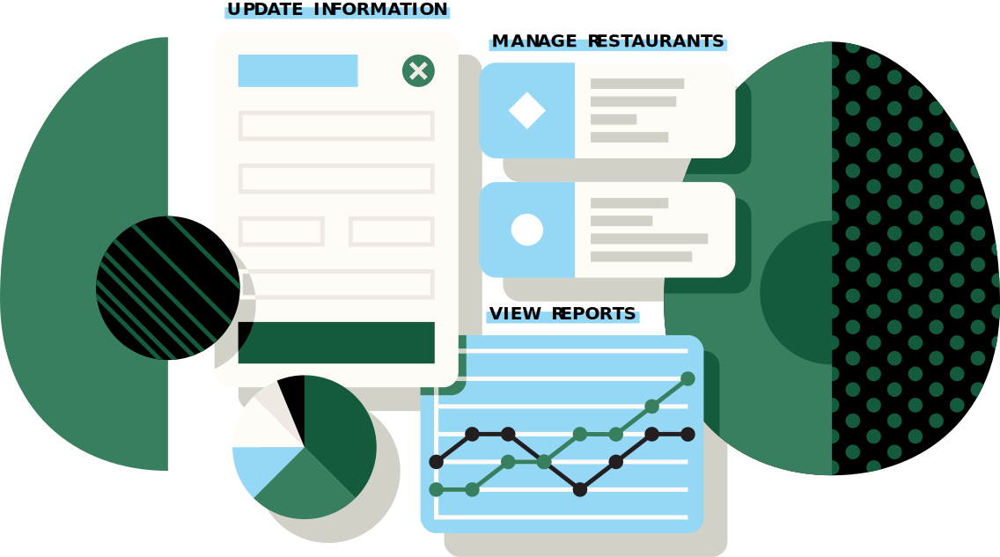

<h1 align="center"> 

</h1>

 

Avocado is a restaurant point of sale and database management system that gives a customer the ability to order food, a restaurant the ability to view and manage current orders, and an owner the ability to edit their menu and analyze sales statistics.

---

<h2 align="center">Creators:</h2>

<a href="https://github.com/corewill">Corey Williams</a>
* <a href="https://github.com/peterriesing">Peter Riesing</a>
* <a href="https://github.com/Lasseignejk">Jaye Lasseigne</a>
* <a href="https://github.com/Meg-Div">Meg Divringi</a>

Corey, Peter, Jaye, and Meg created Avocado while enrolled within the Web Developer program at DigitalCrafts. 

*

Corey set up our Supabase schema, our initial routes and multiple table backend routes, connecting our backend and frontend servers and creating the reporting system for the back-of-house operation page.

 

*

Peter designed our brand identity and styling, creating the restaurant logos and layout with Adobe Illustrator, and implementing the menu, cart, and order confirmation pages as well as their frontend Supabase routes. 

 

*

Jaye was our project manager and styling TailwindCSS specialist, leading our multiple daily standups, acting as our instructor liaison, creating our mockup flow chart in Figma and database schema in DB designer, as well as managing our Github project tracking page, setting up our Supabase storage, and deploying our project front and back ends on Render. 

 

*

Meg designed the login, signup, and dashboard logic as well as the reducers slice for our Redux state, implementing state persist, our front-end routes and state logic queries, and creating our reporting in Plotly to showcase database statistics.

---

<h2 align="center">Languages/ Technologies:</h2>

React
* JavScript
* Redux
* Supabase
* TailwindCSS
* Plotly
* Toastify
* State Persist
* HTML/CSS

---

<h2 align="center">Use/View:</h2>
To view the project, click here: <a href="https://avocado-frontend.onrender.com/">Live Site</a>
  
To read the project blog, head to: <a href="https://dev.to/megdiv/avocado-3im3
">Project Blog</a>
  
To watch a video walkthrough, make your way to YouTube: <a href="https://www.youtube.com/watch?v=wsLZCA090U4
">Walkthrough</a>

 

 

 
 

